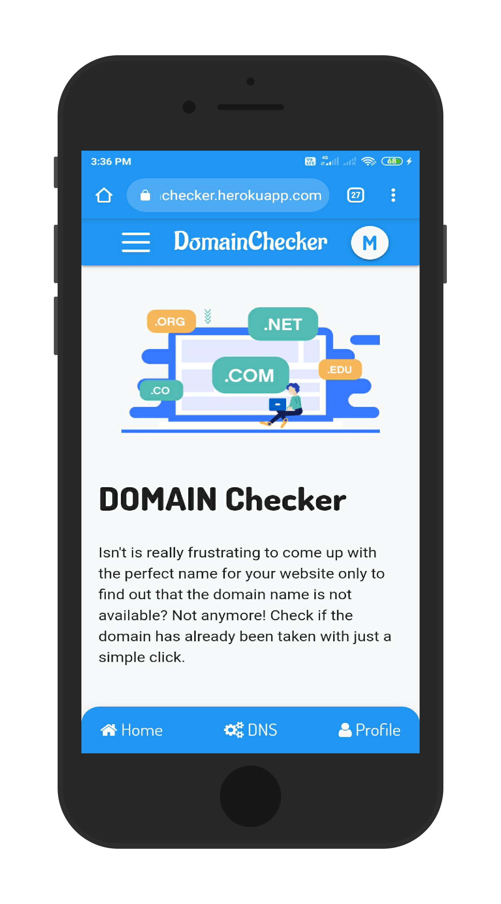
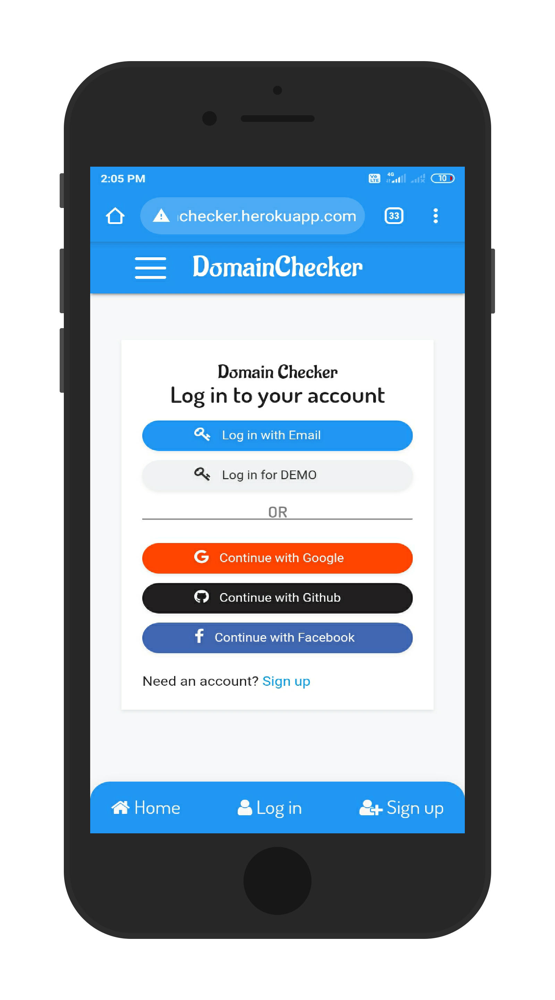
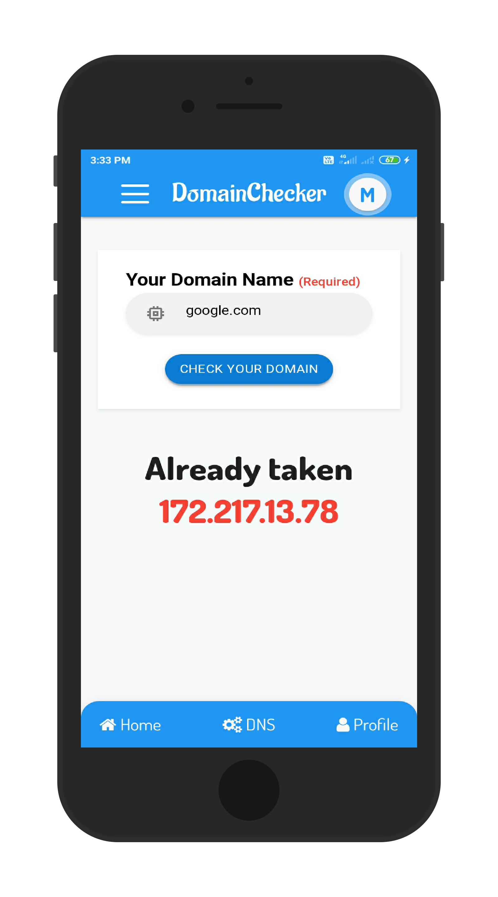
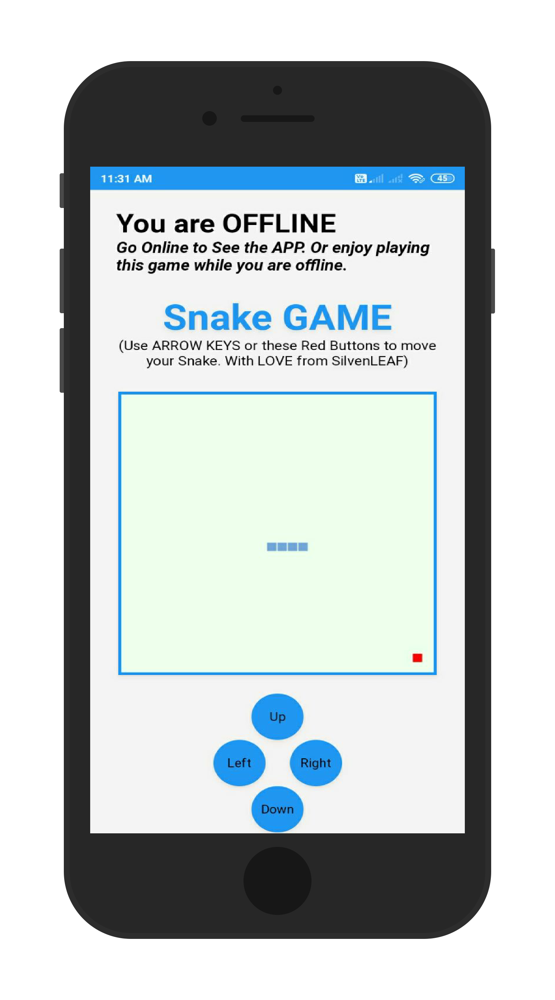
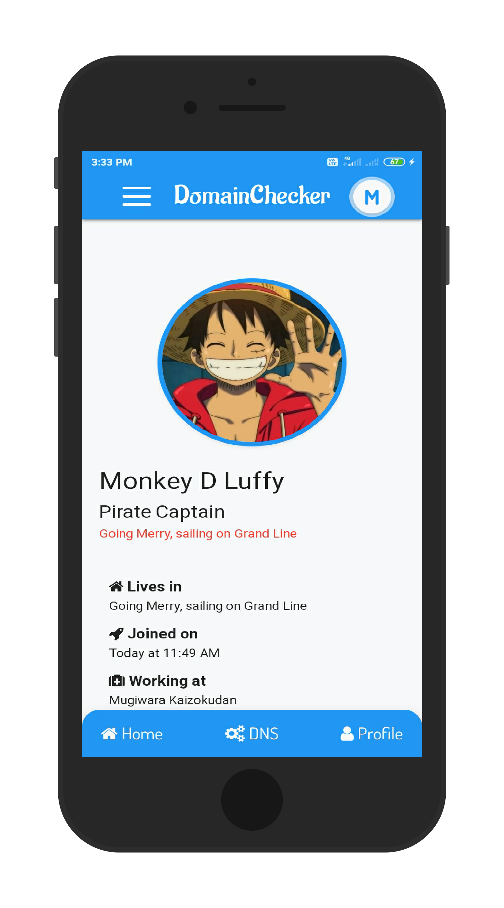

# DomainChecker
Isn't it really frustrating to come up with the perfect name for your website only to find out that the domain name is not available? Not anymore! Check if the domain has already been taken with just a simple click.
***

## See LIVE
<a href="https://silvenleafdomainchecker.herokuapp.com">https://SilvenLeafDomainChecker.herokuapp.com</a>

***

## Top features
*  **DNS Checker**
* **OAUTH 2.0**
* **REST API**
* **CRUD**
* **PWA (with Offline Game)**
* Demo Login
* Connect with other Users
* **


## Technologies
**BackEND:**  *NodeJS, ExpressJS, PassportJS (OAUTH2.0), REST Api, DNS module*

**FrontEND:** *React, SASS, Materialize, Hooks and Context API*

**Database:** *MongoDB (with mongoose)*

**PWA (with Offline Game):** *ServiceWorker, Lighthouse Audit, HTML5, CSS3, Vanilla JavaScript*


**Others:** *git, Chrome Dev Tools, CLI, npm, VS Code*
* **

## Hosted on
**Heroku** as *AlvenLEAF@gmail.com*
***

## How to install on your PC?

##### prerequisites
- [x] NodeJS installed on your PC
- [x] Internet connection on your PC

First make sure you have NodeJS installed on your PC and your PC has internet connection (*because we are using MongoDB Atlas, I mean we are using MongoDB on the cloud, so you need internet connection to connect to this cloud Database*). Then clone the repo. Open it on your favourite Text Editor (mine is VS Code). Then, run this command on your terminal to install all the dependencies...
  
```npm install```


Then run this command...

```npm start``` or ```node app.js```

It will start your local server. Wait until you see these logged on your terminal

``
  Server is running on port 5000
``
``
  connected to MongoDB 
``


Now open your favorite browser (mine is Chrome) and then go to **localhost:5000**. You will see the App runnig live on your PC. Now enjoy playing with the codebase!


***All the BEST!!!***
***

## Gallery







***
